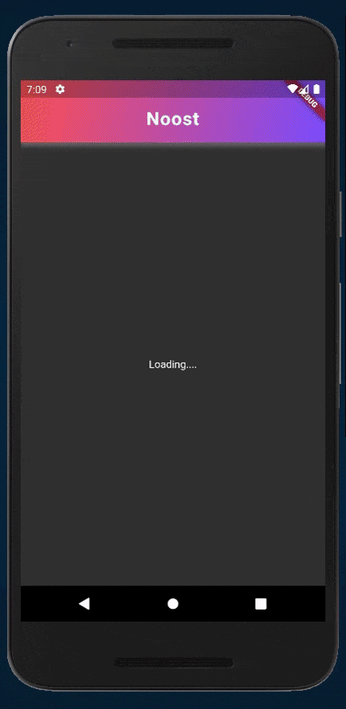
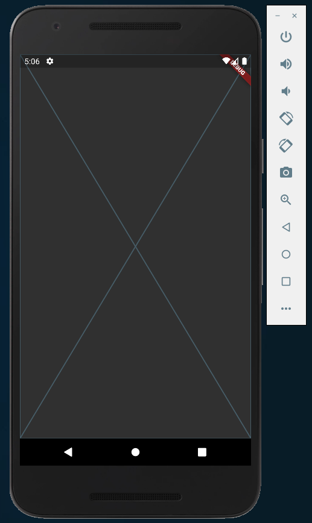
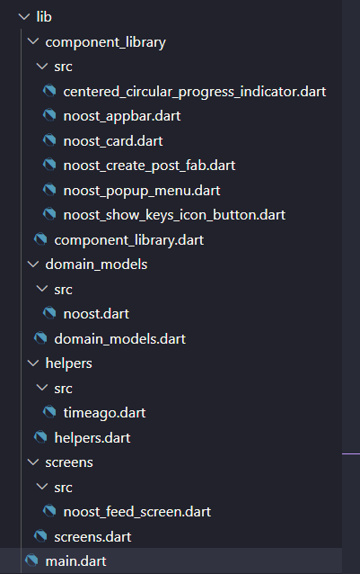
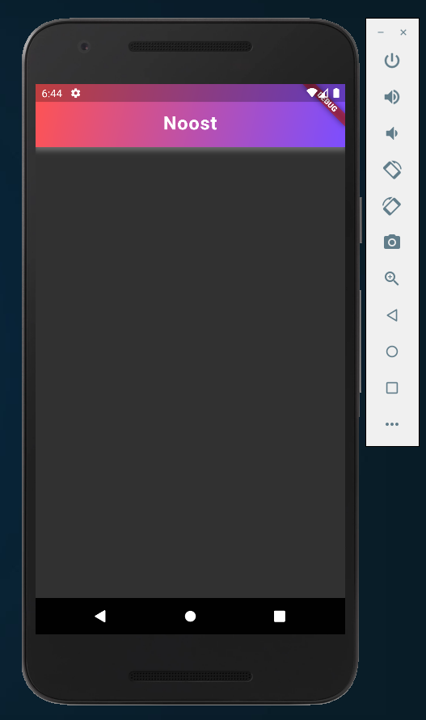
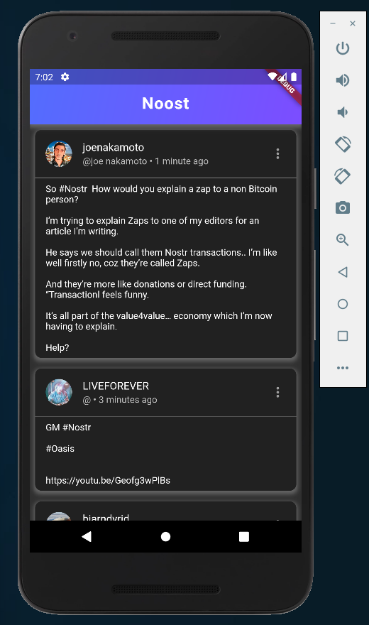

<div align="center">
    
    <h1> Nostr Tools Flutter Tutorial: Building a simple feed for Noost app [Part 1] </h1>
</div>

Welcome to the Nostr Tools Flutter Tutorial!

Are you ready to build your first Nostr client mobile app - **Noost**? If you have some knowledge of the Flutter framework and a basic understanding of the Nostr Protocol, then you're in the right place.



Before we begin, it's important to note that this tutorial is just part one of a three-part series. In this tutorial, we'll cover how to implement a simple feed in Nostr as show in the above gif.

Let's get started!

## Setting up the Project
To get started with Nostr development, we first need to clone the **starter** project. This project contains pre-built UI widgets that we'll use to build our app.

Here's how you can clone the starter project, open your terminal and run the following command:
```bash
$ git clone https://github.com/aniketambore/ntf-materials.git
$ cd ntf-materials/01-noost-client/projects/starter
$ code .
```

This will open the **starter** project in VS Code. Alternatively, you can use your favorite IDE to open the **starter** project. Once you've opened it, run `flutter pub get` if necessary, and then run the app.

When you run the app, you'll see a simple placeholder on the screen, like this:


## Project Files
Before we dive into building Noost, let's take a look at the project files in the `lib` directory. You'll notice four new folders:



- `components_library`: contains all your custom widgets.
- `domain_models`: contains all your models.
- `helpers`: contains the helper functions that we'll use in our app.
- `screens`: contains the screens of our app.

Each of these folders has a `*.dart` file that serves as a barrel file. The barrel file exports all the relevant components, making it convenient to import them later on.

These files will help you get started with Nostr development in your app. Now that you're familiar with the project files, let's move on to install `nostr_tools` package.

## Installing Nostr Tools
To start using Nostr Tools, open the `pubspec.yaml` file and add the `nostr_tools` package as a dependency:

```yaml
dependencies:
  nostr_tools: ^1.0.7
```

After that, run `flutter pub get` to install the package.

Great! You're now ready to start developing the Noost app. Let's begin by creating the Nostr feed screen.

## Nostr Feed Screen
Now that we have everything set up, let's start by building a simple feed in Nostr. Open the `noost_feed_screen.dart` file in the `lib/screens/src` directory.

First, we need to add a few essential imports:
```dart
import 'package:noost_client/component_library/component_library.dart';
import 'package:noost_client/domain_models/domain_models.dart';
import 'package:noost_client/helpers/helpers.dart';
import 'dart:convert';
import 'package:nostr_tools/nostr_tools.dart';
```

Then, add some initial variables to the `_NoostFeedScreenState` class:

```dart
class _NoostFeedScreenState extends State<NoostFeedScreen> {
  // 1
  bool _isConnected = false;
  // 2
  final _relay = RelayApi(relayUrl: 'wss://relay.damus.io');
  // 3
  final List<Event> _events = [];
  // 4
  final Map<String, Metadata> _metaDatas = {};
  ....
```

Here's what each of these variables does:

1. `_isConnected` hold the status of our relay connection.
2. `_relay` creates an instance of `RelayApi`, which is defined in `nostr_tools`. It requires the relay URL as an argument.
3. `_events` is a list that will hold all the events that we'll get from the relay after subscribing.
4. `_metaDatas` is a map that will hold the mapping of the public key with the user metadata.

In the next section, we will learn how to subscribe to the relay and receive events.

## Relay Stream
Now that we've set up our Noost app, let's learn how to connect to nostr relay stream. This will allow us to listen to new notes and handle them appropriately. In this section, we'll cover the steps to establish a connection, set up an event listener, subscribe to the relay, and listen for incoming events.

### Implementing the Relay Stream
To start, we'll implement the logic for connecting to the relay. We'll do this by implementing a getter method in `_NoostFeedScreenState` called `relayStream`. This method will return a `Stream` object that we can listen to for new notes.

```dart
Stream get relayStream async* {
  // TODO: Establish a connection to the relay
  // TODO: Set up an event listener for relay events
  // TODO: Subscribe to the relay to receive events with a specific filter
  // TODO: Listen for incoming events from the relay and handle them appropriately
}
```

The `async*` keyword indicates that the method is asynchronous and will return a stream of data.

Now let's implement the TODOs of `relayStream`.

### Establishing a Connection
The first thing we need to do is establish a connection to the relay. We'll do this by locating `// TODO: Establish a connection to the relay`, and replacing it with the following:
```dart
final stream = await _relay.connect();
```

This line of code establishes a connection to the nostr relay and returns a `Stream` object that we can listen to.

### Setting up an Event Listener
Now that we have a connection, we need to set up an event listener. Locate `// TODO: Set up an event listener for relay events`, and replace it with the following:

```dart
    // 1
    _relay.on((event) {
      // 2
      if (event == RelayEvent.connect) {
        setState(() => _isConnected = true);
      } else if (event == RelayEvent.error) {
        setState(() => _isConnected = false);
      }
    });
```

Here's how the code works:
1. This sets up an event listener for `_relay`, which will be triggered whenever `_relay` emits a `RelayEvent`.
2. This code block checks the type of the emitted `RelayEvent`. If it is a `connect` event, `_isConnected` is set to `true`. If it is an `error` event, `_isConnected` is set to `false`.

### Subscribing to the Relay
Next, we need to subscribe to nostr relay to receive events that match a specific filter. Locate `// TODO: Subscribe to the relay to receive events with a specific filter`, and replace it with the following:

```dart
    _relay.sub([
      Filter(
        kinds: [1],
        limit: 100,
        t: ["nostr"],
      )
    ]);
```

This code subscribes to nostr relay and specifies that we only want to receive events with a `kind` value of `1` which is registered for short text note. We also set a `limit` of `100` events and a `tag` of `nostr`. This `tag` helps us filter out unwanted events and only receive the ones that has the "nostr" tag.

### Listening for Incoming Events
Now, it's time to listen for incoming events from the relay and handle them appropriately. This is where things start to get really interesting!

First, find the `// TODO: Listen for incoming events from the relay and handle them appropriately`, line in your code, and replace it with the following:

```dart
    // 1
    await for (var message in stream) {
      // 2
      if (message.type == 'EVENT') {
        // 3
        Event event = message.message;

        // 4
        if (event.kind == 1) {
          _events.add(event);
          _relay.sub([
            Filter(kinds: [0], authors: [event.pubkey])
          ]);
        // 5
        } else if (event.kind == 0) {
          Metadata metadata = Metadata.fromJson(jsonDecode(event.content));
          _metaDatas[event.pubkey] = metadata;
        }
      }
      // 6
      yield message;
    }
```

Now, let's break down how the above code works:

1. This line sets up a loop that listens for events from the `stream` object. The `await for` construct allows the loop to be asynchronous, meaning that it can listen for incoming events while continuing to run other parts of the program.

2. This line checks the `type` of the incoming message. If it is an event message, the code inside the if block is executed. There are other types of messages that can be received as well, such as "REQ", "CLOSE", "NOTICE", and "OK", but we're only interested in events for now.

3. This line extracts the `message` object from the incoming message and assigns it to the event variable. This event object contains all of the information we need about the incoming event.

4. If the `kind` of the event is `1`, the event object is added to the `_events` list. Then, a new subscription is created to receive messages from the `event.pubkey` of the author with a `kind` value of `0`. This might sound a bit confusing at first, but it's actually quite simple.
  1. Basically, we're subscribing to events that have a `kind` of `1`, which are notes that meet our filtering criteria. After getting the kind 1 note which looks something like:
    - kind: 1 => `id: 279709d1f497c60b9ea51c54ed4f6077ba0d98077b644b96e8a2c94d4bf1890b, kind: 1, created_at: 1680869710, pubkey: f8e6c64342f1e052480630e27e1016dce35fc3a614e60434fef4aa2503328ca9, sig: cafb6ee6044444301a3a6754c3e34a8f3ba2e1b5ba18221bcc713fd633f64b7a8ea23b7432025218d61c461135e42c3aa6c901846c8fc998dc3faee49ccf5e0c, subscriptionId: 6ff8fe849ab3e64444ab08741a2c2f2ec08142cc81ea03350af97da186db865e, tags: [[t, nostr]], content: gm #nostr ☕️☀️`
  2. But, as you can see in the above example of `kind:1` these notes don't include any metadata about the user who created them. So, we need to also subscribe to events that have a `kind` of `0`, which are metadata events that provide us with more information about the user such as 'username', 'picture' and the other stuff which is related to that specific user who made the particular event. By doing this, we can associate each note with its corresponding user metadata.

5. If the `kind` of the event is `0`, the content of the event is decoded from JSON and assigned to a `metadata` variable. This `metadata` is then associated with the `event.pubkey` of the author in the `_metaDatas` map. This allows us to keep track of the metadata for each user who creates a note.

6. Finally, the incoming `message` is yielded to the `Stream`. This makes the message available to any other parts of the program that are listening to the `Stream`.

That's it for this section! By now, you should have a good understanding of how to listen for incoming events and handle them appropriately. And thanks to [MTG's nostr workshop tutorial](https://www.youtube.com/watch?v=O9bzEvv-oFE), from which I learned the algorithm of getting the metadata of the event after kind:1 events. Be sure to subscribe to his [YouTube](https://www.youtube.com/@mtg4962) channel!

Let's move on!

## Making the App Look Good
Let's give our `NoostFeedScreen` a makeover by adding a custom `NoostAppBar` widget. Simply replace the `Scaffold` with the following code:

```dart
  @override
  Widget build(BuildContext context) {
    return Scaffold(
      appBar: NoostAppBar(
        title: 'Noost',
        isConnected: _isConnected,
      ),
    );
  }
```

We've imported the `NoostAppBar` from our `component_library` and added it to our `Scaffold`, so do import:
```dart
import 'package:noost_client/component_library/component_library.dart';
```

The `isConnected` parameter of the `NoostAppBar` is used to indicate whether the app is connected to the relay or not. It changes the color of the `NoostAppBar` accordingly.



It may not look like much right now, because we're not connected to the relay yet. Let's do that next!

## Connecting to the Relay
In this section, we'll implement the body of the `Scaffold` widget using `StreamBuilder`.

```dart
      // 1
      body: StreamBuilder(
        // 2
        stream: relayStream,
        // 3
        builder: (context, snapshot) {
          // 4
          if (snapshot.hasData) {
            return ListView.builder(
              // 5
              itemCount: _events.length,
              itemBuilder: (context, index) {
                final event = _events[index];
                final metadata = _metaDatas[event.pubkey];
                // 6
                final noost = Noost(
                  noteId: event.id,
                  avatarUrl: metadata?.picture ??
                      'https://robohash.org/${event.pubkey}',
                  name: metadata?.name ?? 'Anon',
                  username: metadata?.displayName ??
                      (metadata?.display_name ?? 'Anon'),
                  time: TimeAgo.format(event.created_at),
                  content: event.content,
                  pubkey: event.pubkey,
                );
                // 7
                return NoostCard(noost: noost);
              },
            );
            // 8
          } else if (snapshot.connectionState == ConnectionState.waiting) {
            return const Center(child: Text('Loading....'));
            // 9
          } else if (snapshot.hasError) {
            return Center(child: Text('Error: ${snapshot.error}'));
          }
          // 10
          return const CenteredCircularProgressIndicator();
        },
      ),
```

There's quite a lot to understand here. To break it down:

1. `StreamBuilder` is a widget that listens to the `relayStream` and returns a widget tree based on the state of the stream.

2. The `stream` property is set to `relayStream`, which is the stream we defined earlier in our code.

3. The `builder` callback is called whenever a new event is emitted from the stream.

4. Inside the `builder` callback, the `snapshot` object contains the latest event from the stream.
  - If `snapshot.hasData` is `true`, we have data to display. In this case, we return a `ListView.builder` that displays a list of `NoostCard` widgets.

5. The `itemCount` property of the `ListView.builder` is set to `_events.length`, which is the number of events in the `_events` list.

6. For each event, we create a `Noost` object that encapsulates the details of the event, including the `id`, `avatarUrl`, `name`, `username`, `time`, `content`, and `pubkey`.
  - Here is the power of the `_metaDatas` map as we're able to map the event pubkey with the metadata of the author.

7. We then create a `NoostCard` widget with the `Noost` object as input and return it from the `itemBuilder`.

8. If `snapshot.connectionState` is `ConnectionState.waiting`, we display a loading indicator.

9. If `snapshot.hasError` is `true`, we display an error message.

10. If none of the above conditions are met, we display a `CenteredCircularProgressIndicator`.

Now, hot restart the app and you'll see the list of Noosts!



Phew! That was a lot of work, but you did it. Pretty amazing!

Congratulations, you've reached the end of part 1 of this tutorial! You now have a fully-functional Nostr app that can connect to the Nostr relay and display Noosts in a list. In part 2, we'll explore how to generate private and public keys, how to encode and decode them based on the NIP:19 proposal, and how to publish events.

If you have any questions or run into any issues, feel free to ask them in the comments section below or send me a direct message on [Nostr](https://snort.social/p/npub1clqc0wnk2vk42u35jzhc3emd64c0u4g6y3su4x44g26s8waj2pzskyrp9x). I'm happy to help! And if you want to check out the complete code, head over to the [final](https://github.com/aniketambore/ntf-materials/tree/main/01-noost-client/projects/final) directory. Thanks for following along, and I hope you found this tutorial helpful.